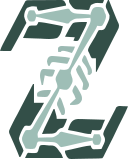

<p align="center">
  
</p>

<h1 align="center">ZamaRig — AI-Powered Auto-Rigging</h1>

<p align="center">
  <strong>Upload a static 3D mesh. Get an animation-ready rigged model in seconds.</strong>
</p>

<p align="center">
  <a href="#-features">Features</a> •
  <a href="#%EF%B8%8F-architecture">Architecture</a> •
  <a href="#-rigging-pipeline">Pipeline</a> •
  <a href="#-tech-stack">Tech Stack</a> •
  <a href="#-getting-started">Getting Started</a> •
  <a href="#-project-structure">Project Structure</a> •
  <a href="#-api-reference">API</a> •
  <a href="#-license">License</a>
</p>

---

## 🎯 Overview

ZamaRig is a full-stack web application that **automatically rigs 3D models** using a combination of machine learning classification and procedural bone fitting. Users upload a static `.obj` or `.fbx` mesh through a modern web interface, and the system:

1. Renders the model from multiple camera angles
2. Classifies it as **humanoid** or **quadruped** using a trained CNN
3. Generates and fits a skeleton template based on the model's anatomy
4. Applies automatic weight painting (skinning)
5. Returns the rigged model ready for animation

No manual bone placement. No weight painting by hand. Just upload and download.

---

## ✨ Features

- **AI Classification** — EfficientNetB0-based CNN automatically determines model type (humanoid / quadruped)
- **Automatic Skeleton Generation** — Procedural bone placement using bounding box analysis and anatomical proportions
- **Pose Detection** — Detects whether humanoid models are in A-pose or T-pose for accurate fitting
- **Geodesic Skinning** — Advanced weight painting using geodesic distance calculations for natural deformation
- **Interactive 3D Landing Page** — Scroll-driven animations with dissolve effects, model transitions, and skeleton visualization using Three.js
- **Real-time 3D Preview** — Preview uploaded and rigged models directly in the browser with React Three Fiber
- **Dark / Light Theme** — Full theme support across UI and 3D viewport
- **Responsive Design** — Optimized layouts for desktop, tablet, and mobile

---

## 🏗️ Architecture

```
┌─────────────────────────────────────────────────────────────────┐
│                          CLIENT                                 │
│  React + TypeScript + Three.js/R3F + GSAP + Tailwind CSS        │
│  ┌──────────┐  ┌──────────┐  ┌──────────┐  ┌──────────────┐     │
│  │  Landing │  │   Rig    │  │  3D View │  │ Theme System │     │
│  │   Page   │  │   Page   │  │  (R3F)   │  │  (Context)   │     │
│  └──────────┘  └──────────┘  └──────────┘  └──────────────┘     │
└────────────────────────┬────────────────────────────────────────┘
                         │ REST API (multipart/form-data)
                         ▼
┌─────────────────────────────────────────────────────────────────┐
│                        BACKEND                                  │
│  FastAPI + Uvicorn (Async Python)                               │
│  ┌──────────────┐  ┌──────────────┐  ┌──────────────────────┐   │
│  │  API Router  │  │  ML Service  │  │  Blender Service     │   │
│  │  /api/v1/*   │  │  (TF/Keras)  │  │  (subprocess → bpy)  │   │
│  └──────────────┘  └──────────────┘  └──────────────────────┘   │
└────────────────────────┬────────────────────────────────────────┘
                         │ subprocess call
                         ▼
┌─────────────────────────────────────────────────────────────────┐
│                     BLENDER (Headless)                          │
│  Python bpy scripts — runs without GUI                          │
│  ┌────────────┐  ┌──────────────┐  ┌────────────────────────┐   │
│  │  Renderer  │  │   Humanoid   │  │      Quadruped         │   │
│  │  (renders) │  │   Rigging    │  │      Rigging           │   │
│  └────────────┘  └──────────────┘  └────────────────────────┘   │
└─────────────────────────────────────────────────────────────────┘
```

---

## 🔄 Rigging Pipeline

The auto-rigging pipeline follows 6 sequential stages:

### Stage 1 — Upload & Preprocessing
The user uploads a `.obj` or `.fbx` file. The backend saves it temporarily and validates the format.

### Stage 2 — Multi-Angle Rendering
Blender runs headlessly to import the model, center it, and render **silhouette images from 4–6 camera angles** (front, back, left, right, top). These renders serve as input to the classifier.

### Stage 3 — AI Classification
The rendered images are fed into a pre-trained **EfficientNetB0** model (transfer learning on ImageNet). The CNN outputs a category with a confidence score:
- `humanoid` — bipedal characters (humans, robots, etc.)
- `quadruped` — four-legged animals (dogs, horses, etc.)

### Stage 4 — Template Selection & Skeleton Fitting
Based on the classification result, the corresponding skeleton template is loaded. The system:
- Computes the mesh's **bounding box** dimensions
- For humanoids: detects **A-pose vs T-pose** via arm angle analysis
- Scales and positions each bone proportionally using anatomical heuristics
- Handles special cases like finger joints, spine curvature, and tail bones

### Stage 5 — Automatic Weight Painting (Skinning)
Vertices are assigned bone influence weights using:
- **Blender's built-in Auto Weights** as a baseline
- **Geodesic distance-based skinning** for improved deformation quality around joints

### Stage 6 — Export & Download
The fully rigged model is exported as `.glb` (glTF Binary) and served to the frontend for preview and download.

> 📖 For an in-depth technical deep-dive with mathematical foundations, bone hierarchies, and code-level explanations, see [RIGGING_PIPELINE.md](RIGGING_PIPELINE.md).

---

## 🛠 Tech Stack

### Frontend
| Technology | Purpose |
|---|---|
| **React 19** | UI framework with hooks & context |
| **TypeScript** | Type-safe development |
| **Vite** | Build tool & dev server |
| **React Three Fiber** | Declarative Three.js for 3D rendering |
| **Three.js** | WebGL-based 3D engine |
| **GSAP + ScrollTrigger** | Scroll-driven animations & transitions |
| **Lenis** | Smooth scroll behavior |
| **Tailwind CSS 4** | Utility-first styling |
| **React Router 7** | Client-side routing |

### Backend
| Technology | Purpose |
|---|---|
| **FastAPI** | Async Python API framework |
| **Uvicorn** | ASGI server |
| **TensorFlow / Keras** | ML model inference (EfficientNetB0) |
| **Pillow** | Image preprocessing |
| **NumPy** | Numerical operations |
| **Pydantic** | Request/response validation |

### 3D & ML
| Technology | Purpose |
|---|---|
| **Blender 4.x (bpy)** | Headless 3D processing, rendering, rigging |
| **EfficientNetB0** | Image classification (transfer learning) |
| **Geodesic Skinning** | Distance-based vertex weight calculation |

### Deployment
| Technology | Purpose |
|---|---|
| **Vercel** | Frontend hosting (SPA with rewrites) |
| **Bun** | JavaScript runtime & package manager |

---

## 🚀 Getting Started

### Prerequisites

- **Node.js 18+** or **Bun** (recommended)
- **Python 3.10+**
- **Blender 4.x** (must be accessible from command line)

### Frontend Setup

```bash
cd frontend
bun install        # or npm install
bun dev            # starts dev server at http://localhost:5173
```

### Backend Setup

```bash
cd backend
python -m venv venv
source venv/bin/activate       # Windows: venv\Scripts\activate
pip install -r requirements.txt
python main.py                  # starts API at http://localhost:8000
```

### Environment Variables

Create `frontend/.env`:
```env
VITE_API_URL=http://localhost:8000
```

### Production Build

```bash
cd frontend
bun run build      # outputs to dist/
```

---

## 📁 Project Structure

```
auto-rigging/
├── frontend/                    # React + TypeScript SPA
│   ├── public/                  # Static assets (3D models, icons)
│   ├── src/
│   │   ├── components/
│   │   │   ├── landing/         # Landing page components
│   │   │   │   ├── landing-canvas.tsx    # Three.js canvas wrapper
│   │   │   │   ├── landing-model.tsx     # 3D model with scroll animations
│   │   │   │   ├── dissolve-material.ts  # Custom dissolve shader
│   │   │   │   ├── smooth-scroll.tsx     # Lenis smooth scroll + progress bar
│   │   │   │   ├── loading-screen.tsx    # Loading overlay
│   │   │   │   ├── footer.tsx            # Site footer
│   │   │   │   └── sections/            # Individual scroll sections
│   │   │   ├── layout/          # Header, layout wrapper
│   │   │   └── ui/              # Reusable UI components
│   │   ├── config/
│   │   │   └── scroll-anim-config.ts    # Responsive scroll animation values
│   │   ├── hooks/               # Custom React hooks (theme, etc.)
│   │   ├── pages/               # Route pages (Home, Rig)
│   │   ├── services/            # API client services
│   │   └── types/               # TypeScript type definitions
│   ├── vercel.json              # Vercel SPA routing config
│   └── package.json
│
├── backend/                     # FastAPI Python server
│   ├── main.py                  # App entry point
│   ├── requirements.txt
│   ├── app/
│   │   ├── api/v1/
│   │   │   └── endpoints/
│   │   │       └── rigging.py   # POST /api/v1/rigging/process
│   │   ├── core/                # Settings, configuration
│   │   └── services/
│   │       ├── ml_service.py    # TensorFlow model inference
│   │       └── blender_service.py  # Blender subprocess orchestration
│   ├── blender_scripts/
│   │   ├── common/              # Shared utilities
│   │   │   ├── blender_utils.py
│   │   │   ├── fitting_utils.py
│   │   │   ├── mesh_processing.py
│   │   │   ├── mesh_utils.py
│   │   │   └── profile_analysis.py
│   │   ├── humanoid/
│   │   │   ├── analyzer.py      # Pose detection, proportion analysis
│   │   │   └── rigging.py       # Humanoid skeleton generation & fitting
│   │   ├── quadruped/
│   │   │   ├── analyzer.py      # Body segment analysis
│   │   │   └── rigging.py       # Quadruped skeleton generation & fitting
│   │   └── tools/
│   │       ├── take_renders.py  # Multi-angle rendering script
│   │       ├── run_rigging.py   # Rigging orchestrator
│   │       ├── geodesic_skinning.py  # Advanced weight painting
│   │       └── inspect_rig.py   # Debug/inspection utility
│   └── public/                  # Served static files (processed models)
│
├── blender/                     # Standalone Blender utilities
│   ├── scripts/
│   │   ├── render_dataset.py    # Batch render script for dataset creation
│   │   └── export_all.py        # Batch export utility
│   └── add-ons/                 # Custom Blender add-ons
│
├── ml_pipeline/                 # Machine learning training
│   ├── notebooks/
│   │   ├── model_train.ipynb    # EfficientNetB0 training notebook
│   │   └── test.ipynb           # Model evaluation & testing
│   └── saved_models/            # Exported .keras model files
│
├── dataset/                     # Training data
│   ├── models/                  # Raw 3D models (organized by class)
│   ├── renders/                 # Multi-angle renders for training
│   └── test_renders/            # Test set renders
│
├── RIGGING_PIPELINE.md          # In-depth technical documentation
├── TODOS.md                     # Development roadmap & progress
└── README.md                    # ← You are here
```

---

## 📡 API Reference

### `POST /api/v1/rigging/process`

Accepts a 3D model file and returns a rigged version.

**Request:**
```
Content-Type: multipart/form-data

file: <.obj or .fbx file>
```

**Response:**
```json
{
  "status": "success",
  "classification": "humanoid",
  "confidence": 0.97,
  "output_file": "/public/results/<id>/rigged_model.glb"
}
```

**Pipeline Steps (server-side):**
1. Save uploaded file → `public/uploads/`
2. Render silhouettes via Blender subprocess
3. Classify renders via TensorFlow
4. Run appropriate rigging script via Blender subprocess
5. Return rigged `.glb` path

### `GET /`

Redirects to Swagger UI documentation at `/docs`.

---

## 🎨 Landing Page

The landing page features an interactive 3D experience built with React Three Fiber and GSAP:

- **Scroll-driven model animation** — The 3D model moves, rotates, and scales based on scroll position with configurable breakpoint-specific values
- **Dissolve effect** — Custom shader-based morph transition between humanoid and quadruped models in the Classification section
- **Skeleton visualization** — 3D bone meshes rendered on top of the model in the Download section with emissive cyan material
- **Smooth scrolling** — Lenis-powered buttery smooth scroll with GSAP ScrollTrigger integration
- **Responsive configs** — Separate animation values for desktop (>1024px), tablet (768–1024px), and mobile (<768px)
- **Loading screen** — Animated overlay that displays while 3D assets are loading

---

## 📄 License

This project is open source under the [MIT License](LICENSE).

---

<p align="center">
  Built with ❤️ by <a href="https://github.com/zamazincode">zamazincode</a>
</p>
