# Auto-Rigging Pipeline Dokumani (Humanoid + Quadruped)

Bu dokuman, Blender icinde calisan auto-rigging sisteminin nasil calistigini anlatir. Hem humanoid hem quadruped pipeline adimlarini, kullanimdaki fonksiyonlari ve matematiksel temelleri detayli olarak aciklar. Hedef: hic bilmeyen birisinin bile kodu okuyup rahatca degisiklik yapabilecek seviyeye gelmesi.

---

## 0) Koordinat sistemi ve temel kavramlar

**Humanoid pipeline** Z eksenini yukseklik icin kullanir. X sol-sag genislik, Y ise on-arka derinliktir.

**Quadruped pipeline** Y eksenini uzunluk (kuyruk -> bas), Z eksenini yukseklik, X eksenini genislik (sol-sag) olarak kullanir.

**Mesh uzayi**: Olcumler ve landmark tespitleri dunya koordinatlarinda yapilir. Rig'e konumlama icin dunya -> rig lokal donusumu kullanilir.

---

## 1) Ortak moduller ve fonksiyonlar

### 1.1 common/mesh_utils.py

- `get_world_bbox(obj)`: Mesh bbox'ini dunya uzayinda hesaplar. Bbox min/max noktalarini dondurur.
- `get_mesh_dimensions(obj)`: Bbox farkindan $(dx, dy, dz)$ boyutlarini bulur. Z yukseklik olarak geri doner.
- `average_vec(points)`: Nokta listesinin centroid'ini hesaplar.
- `lerp_vec(a, b, t)`: Lineer interpolasyon yapar.
    - Formul: $p = a + (b - a) \cdot t$
- `get_world_verts(obj)`: Tum vertexleri dunya koordinatlarina cevirir.

### 1.2 common/profile_analysis.py

Bu modul cross-section (dilimleme) analizi yapar.

- `build_profile(obj, axis, num_slices)`:
    - Secilen eksen boyunca mesh'i `num_slices` parcaya boler.
    - Her dilimde genislikleri (`width_x`, `width_y`, `width_z`) ve merkezleri hesaplar.
    - Dilimleme hesaplari:
        - Dilim boyu: $\Delta = \frac{axis_{max} - axis_{min}}{N}$
        - Dilim indeksi: $i = \lfloor \frac{value - axis_{min}}{\Delta} \rfloor$

- `smooth_profile(values, window)`: Kayar ortalama uygular.
    - $s_i = \frac{1}{k} \sum_{j=i-h}^{i+h} v_j$ (burada $k = 2h+1$)

- `find_local_extrema(values, prominence_ratio)`:
    - Lokal min/max bulur.
    - "Prominence" filtresi ile kucuk dalgalanmalar elenir. Threshold, $\text{range} \cdot prominence\_ratio$ ile olusur.

### 1.3 common/blender_utils.py

- `pick_target_mesh()`:
    - Aktif objeyi mesh ise secili kabul eder.
    - Degilse sahnedeki en buyuk hacimli mesh'i secer.

- `ensure_object_mode()`: Blender'in Object Mode'da olmasini garanti eder.

- `select_only(obj)`: Tum secimleri kaldirip sadece verilen objeyi secer.

- `append_custom_rig(filepath, obj_name)`:
    - Harici `.blend` dosyasindan armature objesini sahneye ekler.
    - Once `obj_name` ile append dener, olmazsa dosyadaki tum objeleri yukler ve armature bulur.

### 1.4 common/mesh_processing.py

- `preprocess_mesh(obj)`:
    - Remove doubles, normals fix, degenerate dissolve.
    - Auto-weight oncesi mesh temizligi.

- `create_voxel_proxy(target_mesh, voxel_size)`:
    - Remesh (VOXEL) ile mesh'in basitlestirilmis ve kapali bir kopyasini olusturur.
    - Ekipman/aksesuar gibi detaylar yumusatilmis olur.

- `cleanup_proxy(proxy)`:
    - Voxel proxy objesini sahneden siler.

### 1.5 common/fitting_utils.py

#### `solve_two_bone_ik(start, end, len1, len2, pole_direction)`

Iki kemikli zincir icin analitik IK cozumudur (dirsek/diz).

- Mesafe: $d = ||end - start||$
- Eger $d \ge len1 + len2$ ise kemikler duz cizgi olur.
- Eger $d < |len1 - len2|$ ise minimum bukulme ile cozum uretilir.
- Normal durumda kosinus teoremi kullanilir:
  $$\cos(\theta) = \frac{len1^2 + d^2 - len2^2}{2 \cdot len1 \cdot d}$$
- Orta eklem noktasi:
  $$mid = start + \hat{dir} \cdot (len1 \cos\theta) + \hat{pole} \cdot (len1 \sin\theta)$$
    - $\hat{dir}$: start->end dogrultusu
    - $\hat{pole}$: Gram-Schmidt ile dogrultuya dik hale getirilen pole vektor

#### `raycast_find_center(proxy, point, axis)`

- Iki yonlu raycast ile mesh hacminin merkezini bulur.
- `refine_bones_with_raycast(...)` fonksiyonu, humnaoid rig'de kemikleri Y ekseninde merkeze alir.

#### `extract_chain_ratios(rig, chain_config)`

- Template rig zincirlerindeki kemik uzunluklarinin oranlarini cikarir.
- Sonradan modelin boyuna gore yeniden dagitim icin kullanilir.

---

## 2) Humanoid Analyzer (landmark ve pose tespiti)

### 2.1 detect_humanoid_pose(obj)

- Cross-section profili Z ekseninde olusturulur.
- Omuz bolgesindeki genislik ile bel bolgesindeki genislik oranlanir.
- Oran > 2.5 ise T-pose, degilse A-pose kabul edilir.
- Amac: kol acisinin direkt mesh'ten tahmin edilmesi.

### 2.2 detect_humanoid_landmarks(obj)

Bu fonksiyon landmark setini cikartir.

**Adimlar (ozet):**

1. Z boyunca cross-section profili olusturulur.
2. Boyun: ust %35 bolgede en dar lokal minimum.
3. Omuz: boyun seviyesinden %2.5 asagi anatomik tahmin + yakin lokal max (varsa).
4. Bel: omuz ile kalca arasinda en dar nokta.
5. Kalca: belin altinda en genis lokal max.
6. Kasik: kalca altinda genisligin ani dustugu ilk yer.
7. Diz: kasik ile ayak bilegi arasinda 0.55 sapma, minimum %25 hizalama.
8. Sol/sag ayirma: merkez X'e gore ofsetli bandlardan sol ve sag vertex listeleri.
9. Omuz/kalca inset oranlari: tam genisliklere gore oransal iceri cekme.

**Kullanilan ana heuristikler:**

- `shoulder_estimate_z = neck_z - total_height * 0.025`
- Bel arama araligi alt sinir: %43 (bacak ayrimi yaniltmasin diye).
- Omuz ve kalca genislik oranlari:
    - Omuz hedef genisligi: $waist\_width \times 1.3$
    - Kalca hedef genisligi: $waist\_width \times 0.75$
- Omuz ve kalca inset clamp araliklari:
    - Omuz inset: 0.55..0.90
    - Kalca inset: 0.30..0.85

Bu fonksiyonun urettigi landmark'lar `fit_bones_to_anatomy` icin inputtur.

---

## 3) Humanoid Fitting ve Rigleme

### 3.1 fit_bones_to_anatomy(mesh, rig, proxy_mesh=None)

Bu fonksiyon kemikleri anatomik noktalara konumlar. Landmark setini kullanir. Proxy varsa, landmark tespiti proxy uzerinden yapilir.

**Hibrit Z Clamp Yaklasimi**

- Cross-section ile bulunan Z degerleri anatomik yuzde araligina clamp edilir.
- Ornek clamp araliklari:
    - Omuz: %78..%84
    - Boyun: %82..%90
    - Spine root: %48..%56
    - Kalca: %44..%50
    - Diz: %24..%32

**Ana noktalar:**

- Omuzlar: cross-section genislikleri + inset ile merkeze cekilir.
- Eller: ust govdede en uc X noktalari.
- Ayak bilegi: zemin + %3.5 yukari.
- Kalca: bel genisliginin %45'i, yukseklik clamp ile.
- Diz: hip ve ayak bilegi arasinda yerlesim.

**Kol zinciri:**

- Bilek: `lerp(shoulder, hand, 0.82)`
- Dirsek: `lerp(shoulder, wrist, 0.52)` ve X ekseninde kucuk offset

**Omurga zinciri:**

- Spine root -> omuz seviyesine 5 esit segment
- Boyun ve bas icin ekstra iki segment

**Ayak/toe/heel:**

- Ayak ucu ileri uzatilir (`foot_forward_len = mesh_h * 0.04`)
- Toe ve heel uzunluklari mesh yuksekligine gore oranlidir.

### 3.2 apply_regional_scaling(rig, chain_ratios)

**Amac:** Template rig oranlarini koruyarak eklemleri matematiksel olarak yerine oturtmak.

- Kollar:
    - Upper/fore/hand oranlari template'ten alinir.
    - Bilek noktasi, el ucundan `len_hand` kadar geri cekilir.
    - Dirsek, `solve_two_bone_ik` ile cozulur.

- Bacaklar:
    - Thigh/shin oranlari template'ten alinir.
    - Diz, `solve_two_bone_ik` ile cozulur. Pole vektor Y- (diz one kirilir).

- Omurga:
    - Mevcut Z araligi korunur, segmentler template oranlariyla yeniden dagitilir.

### 3.3 refine_bones_with_raycast(proxy, rig)

- Raycast ile kemikleri mesh hacminin merkezine tasir.
- Humanoid'de Y ekseni merkezleme ana hedef.
- Kemik zinciri baglantilari (shoulder->upper_arm gibi) tekrar senkronize edilir.

### 3.4 auto_rig_advanced()

Humanoid pipeline'in tum akisi:

1. Hedef mesh secilir (`pick_target_mesh`).
2. Transform apply edilir.
3. `preprocess_mesh` calisir.
4. Voxel proxy olusturulur.
5. Pose tespiti (`detect_humanoid_pose`) ile T/A template secilir.
6. Template rig append edilir.
7. Rig, mesh yuksekligine gore uniform scale edilir.
8. Template oranlari cikarilir.
9. `fit_bones_to_anatomy` calisir.
10. `apply_regional_scaling` ile IK dagitimi yapilir.
11. `refine_bones_with_raycast` ile merkezleme.
12. Voxel proxy temizlenir.
13. Auto-weights (ARMATURE_AUTO) ile skinning yapilir.

---

## 4) Quadruped Analyzer (landmark tespiti)

### detect_quadruped_landmarks(obj)

**Y ekseni (kuyruk -> bas) uzerinden cross-section analizi**

1. Profil olusturulur (Y ekseni, 80 dilim).
2. Genislik profili uzerinden iki ana maksimum bulunur:
    - Govus (on yarida en genis)
    - Kalca (arka yarida en genis)
3. Bel: govus ve kalca arasindaki en dar nokta.
4. Boyun: govusten basa dogru genislik %55'e dustugu ilk yer.
5. Bas: neck sonrasinda vertex sayisi azalan kisim.
6. Kuyruk: Y maksimum (profilin sonu).
7. Ayaklar: zemin seviyesine yakin vertexlerden secilir.

**Cikti landmark seti:**

- head_y, neck_y, chest_y, waist_y, hip_y, tail_y
- ground_z, spine_z
- center_x, body_length, body_height, body_width
- front/rear foot pozisyonlari

---

## 5) Quadruped Fitting ve Rigleme

### 5.1 fit_quadruped_bones(mesh, rig, proxy_mesh=None)

Bu fonksiyon quadruped kemiklerini anatomik noktalara tasir.

**Omurga ve zincirler**

- `spine.004` root olarak kullanilir.
- Root Y pozisyonu, chest ve hip arasinda `SPINE_ROOT_Y_RATIO` ile lerp edilir.
- Kuyruk zinciri: root -> tail yonde dagitilir.
- Boyun ve bas zinciri: chest -> neck -> head yonde dagitilir.

**Z seviyeleri**

- `spine_z_line = spine_z - body_h * 0.08`
- Boyun, bas, kuyruk Z degerleri mesh'ten daha dogru olculerle tahmin edilir.

**Arka bacaklar**

- Hip genisligi: `body_w * 0.18 * HIP_WIDTH_MULTIPLIER`
- Ayak bilegi: `ground_z + body_h * FOOT_Z_OFFSET_RATIO`
- Diz pozisyonu: `lerp(hip, ankle, 0.50)` ve Y ekseninde one offset.

**On bacaklar**

- Omuz genisligi: `hip_half_w * 0.6 * SHOULDER_WIDTH_MULTIPLIER`
- Dirsek pozisyonu: `lerp(shoulder_bottom, ankle, 0.50)` ve Y ekseninde geri offset.

**Pelvis ve breast kemikleri**

- Pelvis: root -> thigh head
- Breast: spine.006 tail referansi ile hafif asagi/arka.

### 5.2 apply_quadruped_regional_scaling(rig, chain_ratios)

- Arka ve on bacaklar icin template oranlari kullanilir.
- Zincir uzunluklarina %5 bukunme payi eklenir.
- Pole vektorler:
    - Arka diz: Y-
    - On diz/dirsek: Y+
- `solve_two_bone_ik` ile diz/dirsek bulunur.

### 5.3 refine_quadruped_with_raycast(proxy, rig)

- Quadruped icin sadece X ekseninde merkezleme yapilir.
- Omurga ve boyun kemiklerinde X=0 zorlanir.
- Z raycast kullanilmaz (karin/omurga kaymasi riskine karsi).

### 5.4 auto_rig_quadruped()

Quadruped pipeline akisi:

1. Hedef mesh secilir.
2. Transform apply edilir.
3. `preprocess_mesh` calisir.
4. Voxel proxy olusturulur.
5. Template rig append edilir.
6. Rig, mesh uzunluguna (Y) gore uniform scale edilir.
7. Template oranlari cikarilir.
8. `fit_quadruped_bones` calisir.
9. `apply_quadruped_regional_scaling` ile IK dagitimi yapilir.
10. `refine_quadruped_with_raycast` ile X merkezleme.
11. Voxel proxy temizlenir.
12. Auto-weights ile skinning.

---

## 6) Ornek sayisal akislar

Bu bolumdeki sayilar temsili ve ornek amaclidir. Gercek mesh'e gore degerler degisebilir.

### 6.1 Humanoid ornek (mesh yuksekligi 1.80)

**Varsayimlar**

- `mesh_h = 1.80`, `z_min = 0.00`, `z_max = 1.80`
- Cross-section sonucunda: `neck_z = 1.62`, `shoulder_z = 1.58`, `waist_z = 1.00`, `crotch_z = 0.84`, `knee_z = 0.40`

**Z clamp ornegi**

- Omuz araligi: %78..%84 -> `1.404..1.512`
- `shoulder_z = 1.58` oldugu icin clamp sonucu `1.512`
- Boyun araligi: %82..%90 -> `1.476..1.620`, `neck_z = 1.62` clamp icinde
- Spine root: `(waist_z + crotch_z) / 2 = 0.92`, aralik %48..%56 -> `0.864..1.008`, clamp sonucu `0.92`

**Ayak hesaplari**

- `ankle_z = z_min + mesh_h * 0.035 = 0.063`
- `foot_forward_len = mesh_h * 0.04 = 0.072`
- `toe_len = mesh_h * 0.025 = 0.045`

**Rig olcekleme**

- `rig_height = 1.70` varsayimi ile:
- `scale_factor = (1.80 / 1.70) * 0.92 = 0.974`

**Kol zinciri ornegi (template oranlariyla)**

- `shoulder -> hand` mesafesi `0.70`
- Oranlar: `upper=0.40`, `fore=0.35`, `hand=0.25`
- Uzunluklar: `0.28`, `0.245`, `0.175`
- Bilek, el ucundan `0.175` geri cekilir. Dirsek, `solve_two_bone_ik` ile cozulur.

**IK matematigi (kisa)**

- $d = ||end - start||$
- $\cos(\theta) = \frac{len1^2 + d^2 - len2^2}{2 \cdot len1 \cdot d}$
- Orta nokta: $start + \hat{dir} \cdot (len1 \cos\theta) + \hat{pole} \cdot (len1 \sin\theta)$

### 6.2 Quadruped ornek (uzunluk 1.40, yukseklik 0.60)

**Varsayimlar**

- `body_length = 1.40`, `body_height = 0.60`, `body_width = 0.50`
- `ground_z = 0.00`, `rig_dims.y = 1.20`

**Rig olcekleme (Y bazli)**

- `scale_factor = (1.40 / 1.20) * 0.92 = 1.073`

**Kalca ve omuz genisligi**

- `hip_half_w = body_width * 0.18 = 0.09`
- `shoulder_w = hip_half_w * 0.6 = 0.054`

**Ayak bilegi ve diz offsetleri**

- `ankle_z = ground_z + body_height * 0.20 = 0.12`
- Arka diz offset: `body_length * 0.08 = 0.112` (Y ekseninde one)
- On diz/dirsek offset: `body_length * 0.08 = 0.112` (Y ekseninde geri)

**IK ile bacak dagitimi**

- Hip -> ankle mesafesi `0.45` varsayimi
- Oranlar: `thigh=0.52`, `shin=0.48`
- %5 bukunme payi:
    - `len_thigh = 0.45 * 0.52 * 1.05 = 0.246`
    - `len_shin = 0.45 * 0.48 * 1.05 = 0.227`
- `solve_two_bone_ik` ile diz noktasi hesaplanir.

---

## 7) Pipeline diyagramlari (Mermaid)

### 7.1 Humanoid pipeline

```mermaid
flowchart TD
    A[Start] --> B[Pick target mesh]
    B --> C[Apply transforms]
    C --> D[Preprocess mesh]
    D --> E[Create voxel proxy]

    E --> F[Detect pose T or A on mesh]
    F --> G[Append template rig]
    G --> H[Uniform scale rig]
    H --> I[Extract chain ratios]

    subgraph L1[Landmark analysis]
        L1a[Build Z profile] --> L1b[Smooth widths]
        L1b --> L1c[Find neck upper min]
        L1c --> L1d[Estimate shoulder]
        L1d --> L1e[Find waist torso min]
        L1e --> L1f[Find hip torso max]
        L1f --> L1g[Detect crotch width drop]
        L1g --> L1h[Compute knee Z bias and floor]
        L1h --> L1i[Split left right bands]
        L1i --> L1j[Compute shoulder and hip insets]
    end

    I --> L1a
    L1j --> J[Fit bones to anatomy]

    subgraph L2[Bone fitting details]
        L2a[Clamp Z levels to anatomy ranges] --> L2b[Set shoulders and hands]
        L2b --> L2c[Set hips knees ankles]
        L2c --> L2d[Compute wrist and elbow lerp]
        L2d --> L2e[Build spine chain body neck head]
        L2e --> L2f[Build foot toe heel]
        L2f --> L2g[Set breast bones]
    end

    J --> L2a
    L2g --> K[Regional scaling and IK]

    subgraph L3[Regional scaling and IK]
        L3a[Use template ratios] --> L3b[Arm set wrist]
        L3b --> L3c[Arm solve elbow IK]
        L3c --> L3d[Leg solve knee IK]
        L3d --> L3e[Spine redistribute by ratios]
    end

    K --> L3a
    L3e --> M[Raycast center bones]

    subgraph L4[Raycast Y axis]
        L4a[Center spine heads and tails] --> L4b[Center limb heads and tails]
        L4b --> L4c[Sync chain connections]
    end

    M --> L4a
    L4c --> N[Cleanup proxy]
    N --> O[Skinning ARMATURE AUTO]
    O --> P[Done]
```

### 7.2 Quadruped pipeline

```mermaid
flowchart TD
    A[Start] --> B[Pick target mesh]
    B --> C[Apply transforms]
    C --> D[Preprocess mesh]
    D --> E[Create voxel proxy]
    E --> F[Append template rig]
    F --> G[Uniform scale rig Y length]
    G --> H[Extract chain ratios]

    subgraph Q1[Landmark analysis]
        Q1a[Build Y profile] --> Q1b[Smooth widths]
        Q1b --> Q1c[Find chest max]
        Q1c --> Q1d[Find hip max]
        Q1d --> Q1e[Find waist min]
        Q1e --> Q1f[Find neck width drop]
        Q1f --> Q1g[Find head low count]
        Q1g --> Q1h[Find feet near ground]
    end

    H --> Q1a
    Q1h --> I[Fit bones to anatomy]

    subgraph Q2[Bone fitting details]
        Q2a[Root at spine 004] --> Q2b[Spine Z line inside body]
        Q2b --> Q2c[Distribute tail chain]
        Q2c --> Q2d[Distribute body neck head chains]
        Q2d --> Q2e[Rear legs hip knee ankle toe]
        Q2e --> Q2f[Front legs shoulder elbow ankle toe]
        Q2f --> Q2g[Pelvis and breast bones]
    end

    I --> Q2a
    Q2g --> J[Regional scaling and IK]

    subgraph Q3[Regional scaling and IK]
        Q3a[Use template ratios] --> Q3b[Rear legs IK pole Y minus]
        Q3b --> Q3c[Front legs IK pole Y plus]
    end

    J --> Q3a
    Q3c --> K[Raycast center X only]

    subgraph Q4[Raycast X axis]
        Q4a[Center leg heads and tails] --> Q4b[Force spine X zero]
    end

    K --> Q4a
    Q4b --> L[Cleanup proxy]
    L --> M[Skinning ARMATURE AUTO]
    M --> N[Done]
```

---

## 8) Tuning noktalarini degistirme rehberi

Humanoid tarafinda sik ayarlanan noktalar:

- Z clamp araliklari (omuz, boyun, kalca, diz)
- `shoulder_inset` ve `hip_inset` hesaplari
- `foot_forward_len` ve `toe_len`
- Dirsek/ayak bilegi lerp oranlari (0.82, 0.52)

Quadruped tarafinda sik ayarlanan noktalar:

- `HIP_WIDTH_MULTIPLIER`, `SHOULDER_WIDTH_MULTIPLIER`
- `FOOT_Z_OFFSET_RATIO`, `FRONT_FOOT_Z_OFFSET`
- `REAR_KNEE_BEND_RATIO`, `FRONT_KNEE_BEND_RATIO`
- `SPINE_ROOT_Y_RATIO`

> Bu degerler anatomik gorunum ve rig esnekligi icin kritik. Kucuk adimlarla degistirmek iyi olur.

---

Bu dokuman, rig pipelinenını anlatmak için AI ile yazılmıştır.
